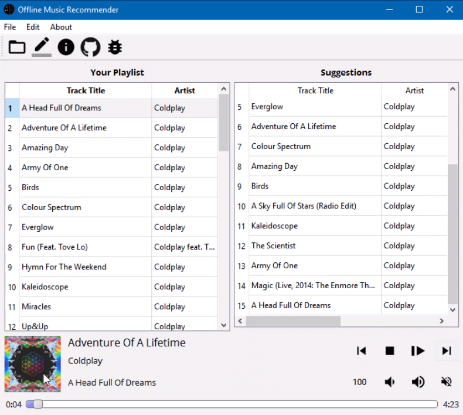
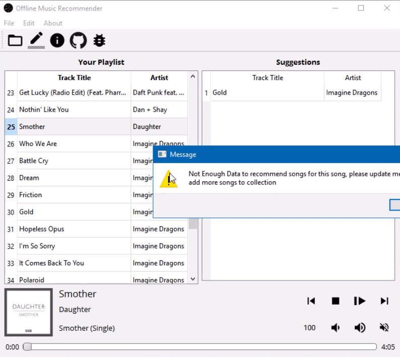
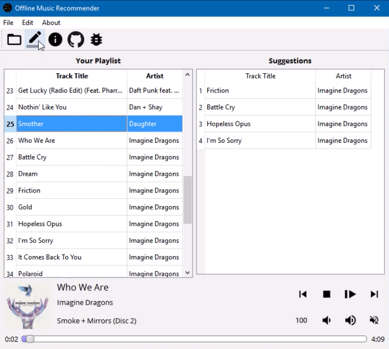
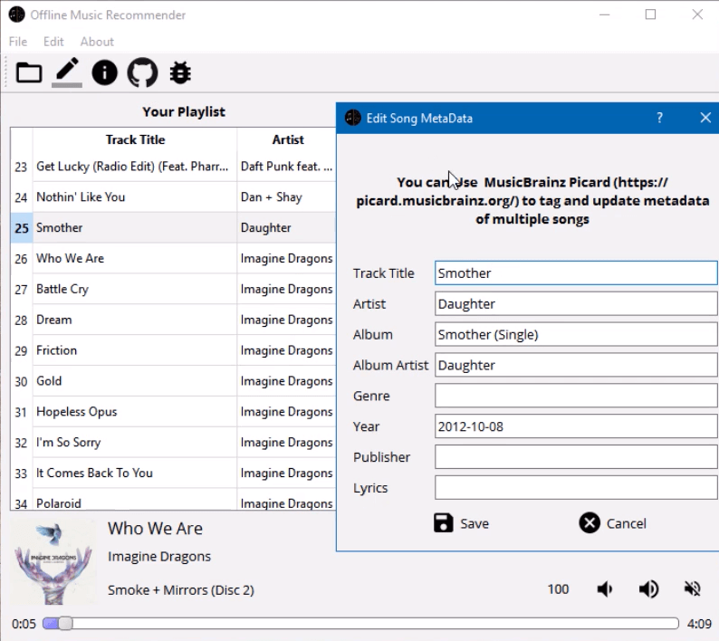
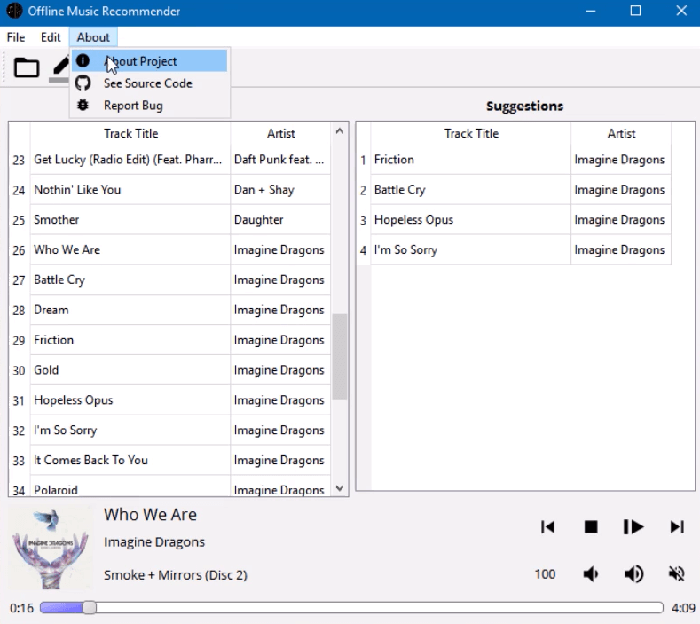

## Recommend

#### :headphones: :notes: An Offline Music Recommender

Recommend is a project that is trying to use clustering on metadata(ID3-tags)
of your music files to Recommend you similar songs from your Offline Music library

#### Why ?

well we got bored and started a project on something that we like.

all jokes aside, We thought it would be cool to use ID3 tags to find similarity
in your offline music collection.

This project is under heavy development

#### Demo

[Recommend - Demo (alpha)](https://www.youtube.com/watch?v=xF9p5lDcmi4)

## Screenshots

